# Foodies

## Pengembang
Aplikasi ini dibuat oleh:
- Nama: Tatang
- NIM: 23552011175
- Kelas: TIF K 23B

## Tentang Aplikasi

Foodies adalah aplikasi mobile yang dirancang untuk memudahkan pengguna dalam memesan makanan secara online. Dengan antarmuka yang ramah pengguna, aplikasi ini menyediakan berbagai fitur untuk meningkatkan pengalaman memesan makanan.

## Fitur Utama

Aplikasi ini dilengkapi dengan berbagai fitur, antara lain:

- **Autentikasi Pengguna:** Proses pendaftaran dan login yang mudah menggunakan email dan password.
- **Beranda:** Menampilkan menu populer dan menu berdasarkan kategori (seperti snack, dessert, dll.). Setiap menu dilengkapi dengan informasi nama, gambar, harga, dan rating.
- **Pencarian Menu:** Pengguna dapat dengan mudah mencari menu favorit berdasarkan nama.
- **Detail Menu:** Halaman detail untuk setiap menu yang menampilkan informasi lengkap termasuk deskripsi dan ulasan dari pengguna lain.
- **Keranjang Belanja:** Pengguna dapat menambahkan beberapa menu ke dalam keranjang sebelum melakukan pemesanan.
- **Pemesanan:** Proses checkout yang fleksibel, memungkinkan pengguna memilih tipe pemesanan (diantar atau ambil sendiri), alamat pengiriman, dan metode pembayaran.
- **Riwayat Pesanan:** Melacak pesanan yang sedang berlangsung dan melihat riwayat pesanan yang telah selesai.
- **Ulasan dan Rating:** Setelah pesanan selesai, pengguna dapat memberikan rating dan ulasan untuk menu yang dipesan.
- **Manajemen Profil:** Pengguna dapat melihat dan mengelola informasi profil serta alamat pengiriman.
- **Menu Favorit:** Menyimpan menu favorit untuk akses cepat di kemudian hari.

## Teknologi yang Digunakan

- **Framework:** Flutter
- **Backend:** Firebase (Authentication, Firestore)

## Struktur Proyek

Proyek ini disusun dengan arsitektur yang bersih dan modular untuk kemudahan pengembangan dan pemeliharaan:

```
lib/
|-- models/         # Model data untuk aplikasi
|-- services/       # Logika bisnis dan interaksi dengan Firebase
|-- ui/
|   |-- screens/    # Halaman-halaman utama aplikasi
|   |-- widgets/    # Komponen UI yang dapat digunakan kembali
|-- main.dart       # Titik masuk utama aplikasi
```

## Memulai

Untuk menjalankan proyek ini di lingkungan lokal Anda, ikuti langkah-langkah berikut:

1.  **Pastikan Flutter sudah terinstal.** Jika belum, ikuti petunjuk instalasi di [situs resmi Flutter](https://flutter.dev/docs/get-started/install).
2.  **Clone repositori ini:**
    ```bash
    git clone https://github.com/kuswanid/foodies.git
    cd foodies
    ```
3.  **Install dependensi:**
    ```bash
    flutter pub get
    ```
4.  **Jalankan aplikasi:**
    ```bash
    flutter run
    ```


## Preview

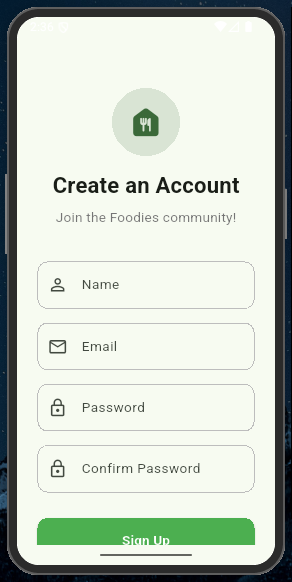
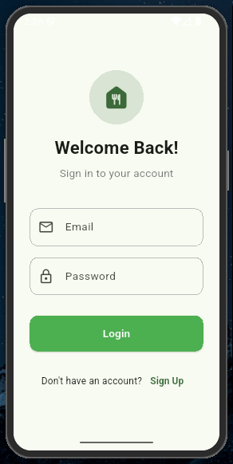
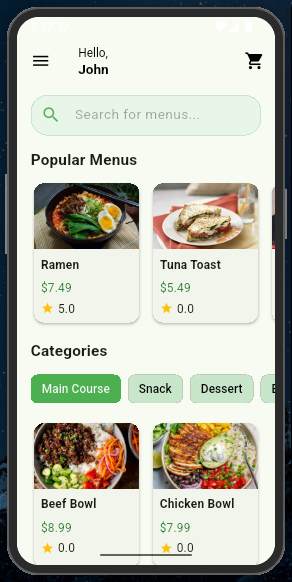
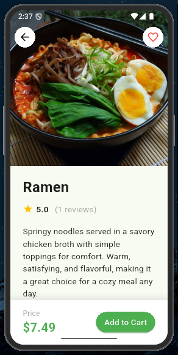
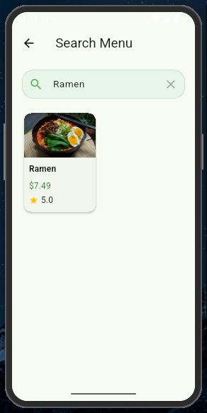
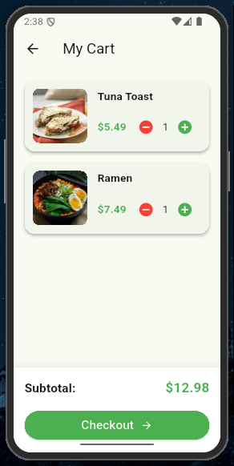
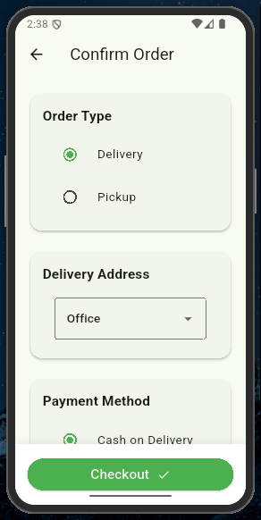
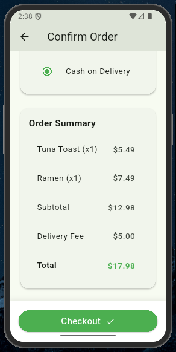
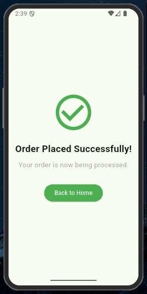
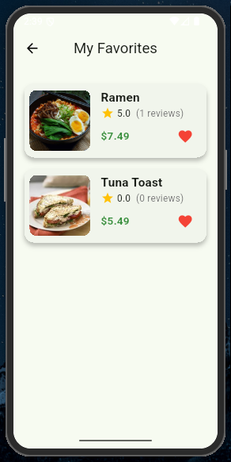
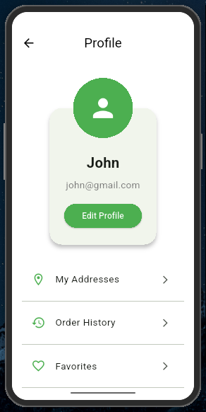
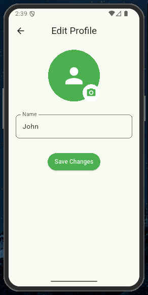
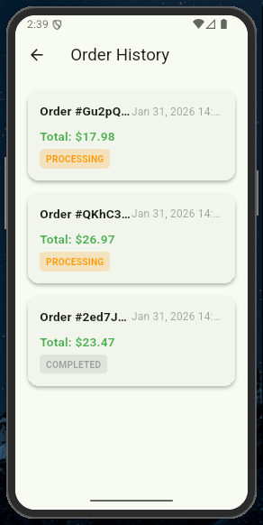
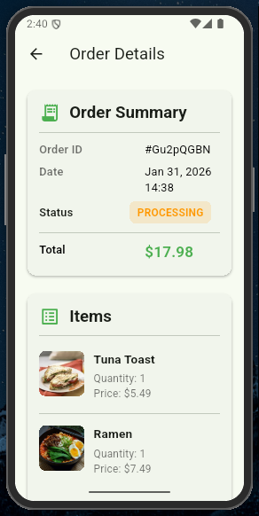
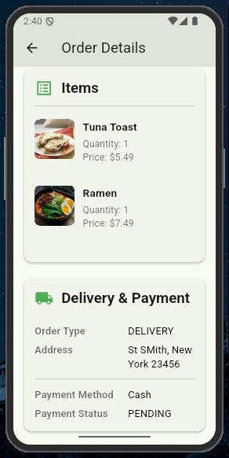
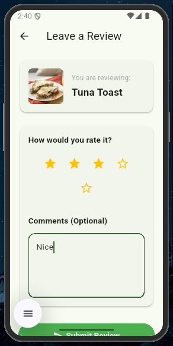
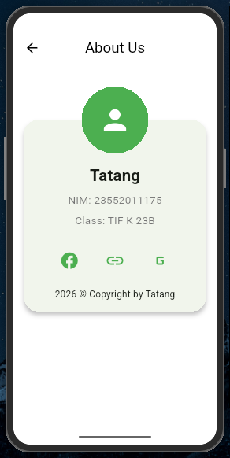
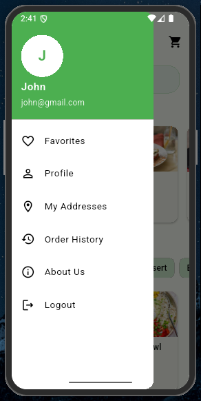

---
Dibuat dengan ❤️ untuk para pecinta kuliner.